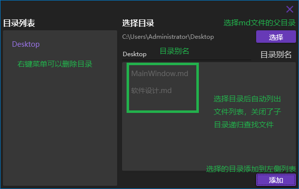
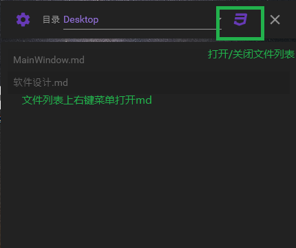
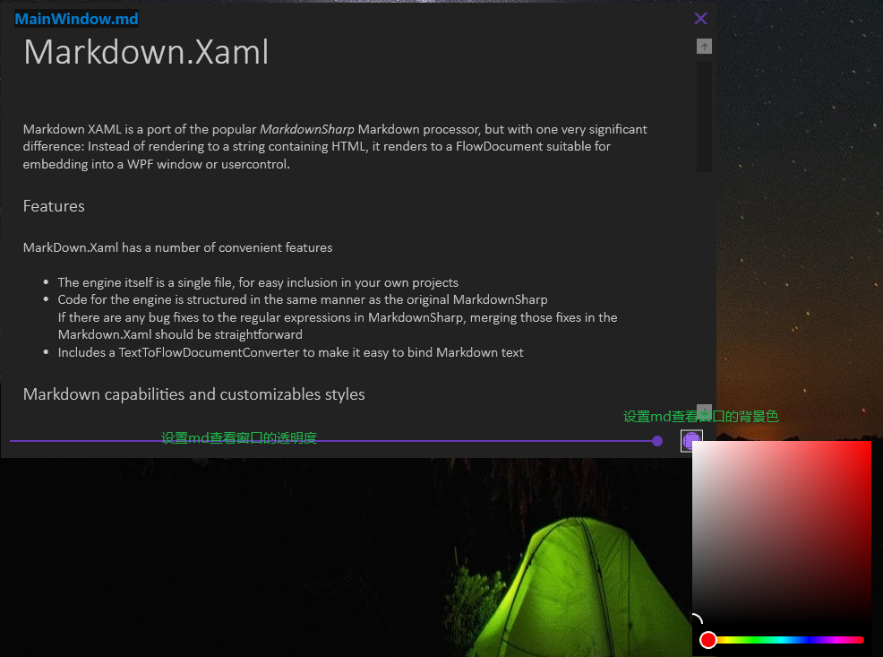

# MarkdownNotes

#### 介绍

Markdown笔记查看软件

#### 为甚做这个软件

近期工作需要做一些新的领域的内容，因为参考了很多文档，自己使用md记录的好多笔记。

工作的同时需要看笔记，而且有些工作需要在虚机加密环境下完成，总之就是需要同时打开很多窗口。

日常工作是双屏的，但是应对这么多窗口的需求，还是吃不消，经常切换屏幕很繁琐，所以决定做此软件，将md文档的查看可以做成半透明的，这样可以减少切换屏幕的动作。

#### 功能

1.  可设置多个md文档目录，目录可以起别名
2.  md文档查看窗口可以设置透明度（20%-100%）
3.	md文档查看窗口可以设置背景颜色
4.  正常关闭的情况下，目录列表和文件列表自动保存

#### 使用

1. 软件首页

   

2. 设置页面

   

3. 首页打开关闭文件列表

   

4. md笔记查看页面

   

#### 其他

懒，不要提意见，提了也不改。做你想做的（MIT）
